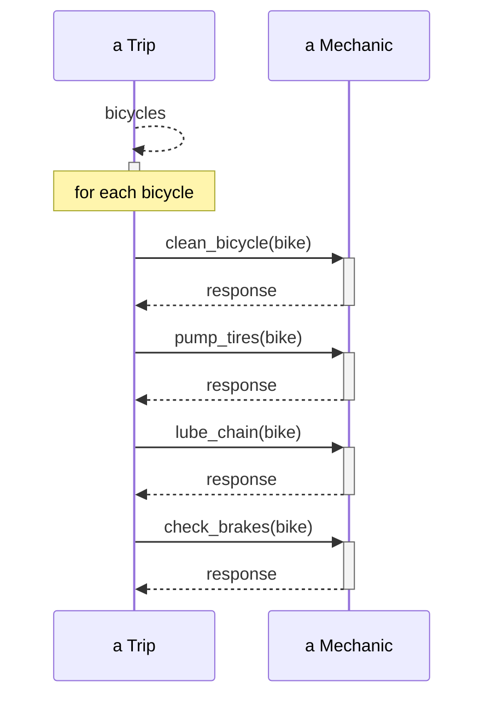
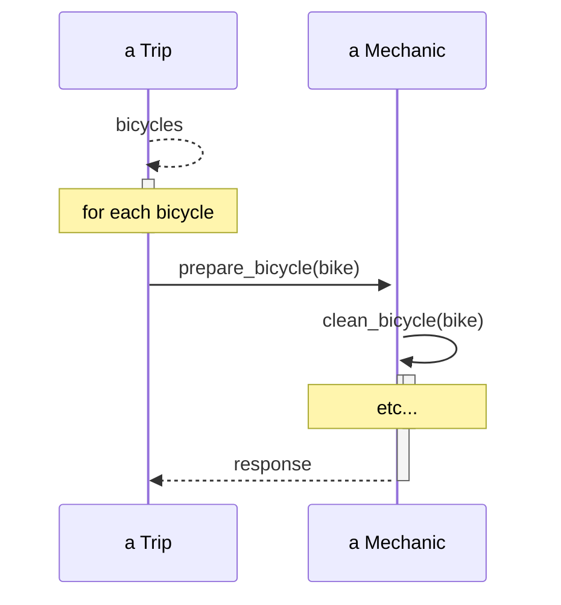
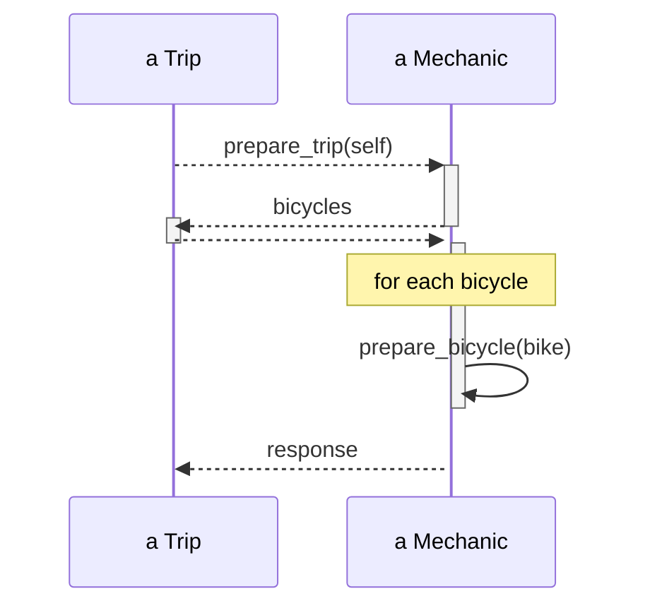
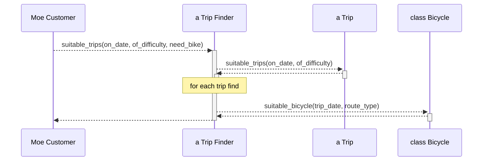

# オブジェクト指向設計実践ガイド

## 「第4章 柔軟なインターフェースをつくる」より

**要件**
旅行が開始されるためには、使われる自転車がすべて整備されていることを確実にする必要がある

問題: TripがMechanicを知りすぎている

mechanicのpubli interfaceはprepare_bicycleだけになった。

- Tripのパプリックインターフェースはbicyclesを含む
- Mechanicのパブリックインターフェースはprepare_tripを含む。ひょっとするとprepare_bicyclesも含みうる
- Tripはprepare_tripに応答できるオブジェクトを持ち続ける事を想定する
- Mechanicはprepare_tripとともに渡されてきた引数がbicyclesに応答する事を想定する

tripfinderのpublic interfaceはsuitable_tripsだけになった。
