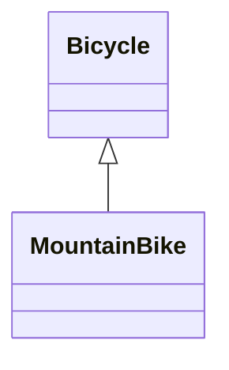
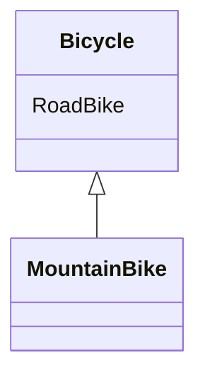
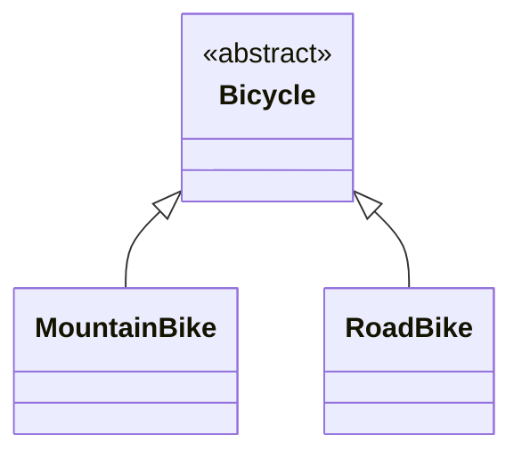

# 自転車クラスの概念図

```mermaid
classDiagram
    Bicycle <|-- MountainBike
```

## 間違った継承

```mermaid
classDiagram
    Bicycle <|-- MountainBike
    class Bicycle {
      RoadBike 
    }
```

BicycleがRoadBikeをもってしまっていて、MountainBikeがRoadBikeも継承してしまう。

## 最終的な目標

```mermaid
classDiagram
  Bicycle <|-- MountainBike
  Bicycle <|-- RoadBike
  <<abstract>> Bicycle 
```
